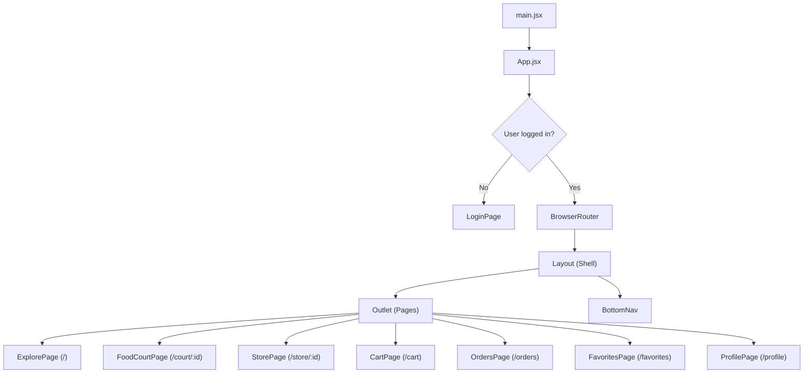
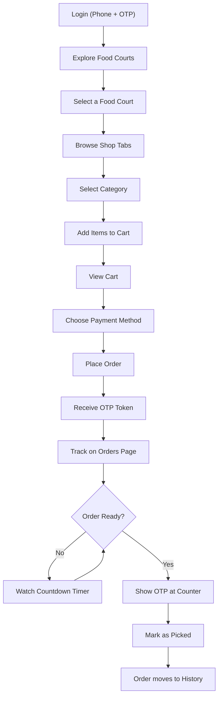

# 🍕 Campus Bites — Full Documentation

> **Queue-free food ordering for campus food courts.**
> Order, pay, and pick up with an OTP token — no waiting in line.

---

## Table of Contents

1. [Overview](#1-overview)
2. [Tech Stack](#2-tech-stack)
3. [Project Structure](#3-project-structure)
4. [Getting Started](#4-getting-started)
5. [Architecture](#5-architecture)
6. [Data Model](#6-data-model)
7. [State Management](#7-state-management)
8. [Pages & Components](#8-pages--components)
9. [User Flows](#9-user-flows)
10. [Design System](#10-design-system)
11. [Accessibility](#11-accessibility)

---

## 1. Overview

**Campus Bites** is a mobile-first React web app that lets students and staff:

- Browse campus food courts and their restaurants
- View menus with categories, prices, and veg/non-veg tags
- Add items to a single-store cart with quantity controls
- Choose a payment method (UPI or Pay on Pickup)
- Place orders and receive a 4-digit OTP for pickup verification
- Track active orders with a live stepper and countdown timer
- Reorder past orders with one tap
- Save favorite stores for quick access
- Customize font size for accessibility

---

## 2. Tech Stack

| Layer | Technology | Version |
|-------|-----------|---------|
| **Framework** | React | 19.2.0 |
| **Build Tool** | Vite | 7.3.1 |
| **Routing** | React Router DOM | 6.30.3 |
| **Icons** | React Icons (Ionicons 5) | 5.5.0 |
| **Styling** | Vanilla CSS (component-scoped) | — |
| **Font** | Outfit (Google Fonts) | 300–800 |
| **State** | React Context + useReducer | — |
| **Linting** | ESLint | 9.39.1 |
| **Language** | JavaScript (ES Modules) | — |

---

## 3. Project Structure

```
campus-bites/
├── index.html                    # Entry HTML with meta tags, font loading
├── package.json                  # Dependencies and scripts
├── vite.config.js                # Vite configuration
├── eslint.config.js              # ESLint configuration
│
├── public/
│   └── vite.svg                  # Vite logo (favicon fallback)
│
└── src/
    ├── main.jsx                  # React root mount point
    ├── App.jsx                   # Route definitions + auth gate
    ├── index.css                 # Global design tokens + utilities
    ├── data.js                   # Mock data (courts, stores, menu, orders)
    │
    ├── context/
    │   └── AppContext.jsx        # Global state (useReducer + Context)
    │
    ├── components/
    │   ├── Layout.jsx            # App shell (Outlet + BottomNav)
    │   ├── BottomNav.jsx         # Bottom tab navigation bar
    │   └── BottomNav.css         # Bottom nav styles
    │
    └── pages/
        ├── LoginPage.jsx         # Phone + OTP authentication
        ├── LoginPage.css
        ├── ExplorePage.jsx       # Food court listing & discovery
        ├── ExplorePage.css
        ├── FoodCourtPage.jsx     # Single food court with shop tabs + inline menus
        ├── FoodCourtPage.css
        ├── StorePage.jsx         # Individual store menu (direct link)
        ├── StorePage.css
        ├── CartPage.jsx          # Cart, payment, order placement
        ├── CartPage.css
        ├── OrdersPage.jsx        # Active + History order tabs
        ├── OrdersPage.css
        ├── FavoritesPage.jsx     # Favorite stores list
        ├── FavoritesPage.css
        ├── ProfilePage.jsx       # User profile & settings
        └── ProfilePage.css
```

---

## 4. Getting Started

### Prerequisites

- **Node.js** 18+ and **npm** 9+

### Install & Run

```bash
# 1. Install dependencies
npm install

# 2. Start development server (hot reload)
npm run dev

# 3. Open in browser
# → http://localhost:5173

# 4. Build for production
npm run build

# 5. Preview production build
npm run preview
```

### NPM Scripts

| Script | Command | Purpose |
|--------|---------|---------|
| `dev` | `vite` | Start dev server with HMR |
| `build` | `vite build` | Production build to `dist/` |
| `preview` | `vite preview` | Preview production build locally |
| `lint` | `eslint .` | Run ESLint on all files |

---

## 5. Architecture

### Application Flow



### Routing Table

| Path | Component | Description |
|------|-----------|-------------|
| `/` | `ExplorePage` | Food court discovery with search & filters |
| `/court/:id` | `FoodCourtPage` | Single food court with shop tabs and inline menus |
| `/store/:id` | `StorePage` | Individual store menu (direct navigation) |
| `/cart` | `CartPage` | Shopping cart with payment and order placement |
| `/orders` | `OrdersPage` | Active orders (preparing/ready) + order history |
| `/favorites` | `FavoritesPage` | List of favorited stores |
| `/profile` | `ProfilePage` | User info, settings, font scale, logout |

### Auth Gate

The app uses a **render-based auth gate** in `App.jsx`. If `state.user` is `null`, the `LoginPage` is shown instead of the router. Upon successful login, `state.user` is set and the full app becomes accessible.

---

## 6. Data Model

All data is defined in `src/data.js` as mock JavaScript arrays.

### Food Courts (`foodCourts`)

```javascript
{
  id: 'fc1',            // Unique ID
  name: 'Central Food Court',
  image: '🏫',          // Emoji icon
  description: 'Main campus food hub near the library',
  storeCount: 4,        // Number of stores
  crowdLevel: 'low',    // low | medium | high
  isOpen: true,
  openTime: '8:00 AM',
  closeTime: '9:00 PM',
}
```

**Total: 8 food courts**

| ID | Name | Stores | Specialty |
|----|------|--------|-----------|
| fc1 | Central Food Court | 4 | Main campus hub |
| fc2 | Engineering Block Canteen | 3 | Quick bites near labs |
| fc3 | Sports Complex Café | 3 | Healthy/fitness options |
| fc4 | Arts & Media Plaza | 3 | Artisan coffee & fusion |
| fc5 | Hostel Block Mess | 3 | Late-night snacks |
| fc6 | Medical Campus Café | 3 | Organic & healthy |
| fc7 | Business School Lounge | 3 | Premium dining |
| fc8 | Lakeside Dhaba | 2 | Punjabi dhaba (closed) |

### Stores (`stores`)

```javascript
{
  id: 's1',
  courtId: 'fc1',       // Links to parent food court
  name: 'Desi Tadka',
  image: '🍛',          // Emoji icon
  cuisine: 'North Indian',
  rating: 4.5,          // Out of 5.0
  prepTime: '10-15 min',
  isOpen: true,
  isFavorite: false,     // Default favorite status
}
```

**Total: 24 stores** across all food courts

### Menu Items (`menuItems`)

```javascript
{
  id: 'm1',
  storeId: 's1',        // Links to parent store
  name: 'Paneer Butter Masala',
  category: 'Main Course',
  price: 150,           // In ₹ (INR)
  prepTime: 12,         // In minutes (used for order estimation)
  isVeg: true,
  image: '🧈',
  description: 'Rich and creamy paneer in tomato gravy',
}
```

**Total: 100 menu items** across all stores

### Helper Functions

| Function | Returns | Purpose |
|----------|---------|---------|
| `generateOTP()` | `string` (4 digits) | Generates random 4-digit OTP |
| `generateOrderId()` | `string` (e.g. `ORD-M1A2B3`) | Generates unique order ID from timestamp |

### Sample Orders (`sampleOrders`)

Pre-populated with one demo order in "preparing" status to showcase the active orders UI.

---

## 7. State Management

### Architecture

The app uses **React Context + `useReducer`** for global state management.

```
AppProvider (context/AppContext.jsx)
  └── useReducer(reducer, initialState)
       ├── state   → read anywhere via useApp()
       └── dispatch → fire actions via useApp()
```

### Initial State

```javascript
{
  user: null,                    // { phone } when logged in
  cart: [],                      // [{ ...menuItem, quantity }]
  cartStoreId: null,             // Only one store at a time
  orders: sampleOrders,          // Pre-loaded demo orders
  favoriteStoreIds: ['s3', ...], // From stores with isFavorite: true
  fontScale: 1,                  // Accessibility font scaling (0.8 – 1.4)
}
```

### Actions (Dispatch Types)

| Action | Payload | Effect |
|--------|---------|--------|
| `LOGIN` | `{ phone }` | Sets `user`, unlocks the app |
| `LOGOUT` | — | Clears `user`, shows login |
| `ADD_TO_CART` | `menuItem` | Adds item or increments quantity. If different store, clears cart first |
| `REMOVE_FROM_CART` | `itemId` | Removes item from cart |
| `UPDATE_QUANTITY` | `{ id, quantity }` | Sets quantity. Removes item if ≤ 0 |
| `CLEAR_CART` | — | Empties cart and resets `cartStoreId` |
| `PLACE_ORDER` | `{ storeName, paymentMethod }` | Creates new order, generates OTP + order ID, clears cart |
| `UPDATE_ORDER_STATUS` | `{ orderId, status }` | Changes order status (preparing → ready → picked) |
| `TOGGLE_FAVORITE` | `storeId` | Adds/removes store from favorites |
| `SET_FONT_SCALE` | `number` | Updates font scale (0.8 – 1.4) |
| `REORDER` | `order` | Copies order items into cart |

### Custom Hook

```javascript
import { useApp } from '../context/AppContext';

const { state, dispatch } = useApp();
// state.cart, state.orders, state.user, etc.
// dispatch({ type: 'ADD_TO_CART', payload: menuItem })
```

---

## 8. Pages & Components

### Components

#### `Layout.jsx`
The app shell that wraps all authenticated pages.
- Sets `--font-scale` CSS variable from state
- Includes a **skip-to-content** link for screen readers
- Renders `<Outlet />` for routed page content
- Renders `<BottomNav />` fixed at the bottom

#### `BottomNav.jsx`
Fixed bottom tab bar with 4 navigation tabs:

| Tab | Icon | Route | Badge |
|-----|------|-------|-------|
| Explore | 🧭 `IoCompass` | `/` | — |
| Orders | 🧾 `IoReceipt` | `/orders` | Active order count |
| Favorites | ❤️ `IoHeart` | `/favorites` | — |
| Profile | 👤 `IoPersonCircle` | `/profile` | — |

Uses `NavLink` for automatic active state styling.

---

### Pages

#### 1. LoginPage (`/` — unauthenticated)

**Two-step phone + OTP authentication flow:**

| Step | UI | Interaction |
|------|-----|-------------|
| **Phone** | Country prefix (+91), phone input | Validates Indian mobile (starts with 6–9, 10 digits) |
| **OTP** | 4 individual digit boxes | Auto-focus next, backspace goes back |

**Features:**
- Simulated OTP send (800ms delay)
- 30-second resend cooldown with countdown
- Loading spinner on buttons
- Error messages for invalid input
- Background decorative circles
- Terms & Privacy Policy links

---

#### 2. ExplorePage (`/`)

**Food court discovery and search page.**

**Features:**
- Conversational hero: "What would you like to **eat today**?"
- Full-text search across court names and descriptions
- Filter pills: All / Open Now / Less Crowd
- Stats bar: total food courts, total stores, open count
- Food court cards with:
  - Emoji visual area (gradient background)
  - Average store rating (computed)
  - Color-coded crowd indicator (🟢 Low / 🟡 Moderate / 🔴 Busy)
  - Open/Closed status with visual distinction
  - Operating hours
  - Forward arrow for navigation

---

#### 3. FoodCourtPage (`/court/:id`)

**Single food court view with inline store browsing.**

**Features:**
- Back navigation + court info header
- **Shop tabs** — horizontal scrollable pills at the top, each showing:
  - Store emoji + name + open/closed status
  - Orange active highlight
- **Store info bar** — shows selected store's cuisine, rating, prep time, and favorite toggle
- **Category tabs** — filter menu items by category (horizontal scroll)
- **Menu items** — dish cards showing:
  - Emoji, name, description, price
  - Veg/non-veg indicator (green/red dot)
  - ADD button (or +/−/quantity controls if already in cart)
- **Sticky cart bar** — shows total items + price with "View Cart →" button (appears when cart has items from this store)

---

#### 4. StorePage (`/store/:id`)

**Individual store menu page** (direct link alternative to FoodCourtPage tabs).

**Features:**
- Store banner with emoji, name, cuisine, rating, prep time
- Favorite toggle (heart button)
- Category tabs for filtering
- Menu item list with add-to-cart controls
- Sticky cart bar

---

#### 5. CartPage (`/cart`)

**Shopping cart with checkout flow.**

**Features:**
- Store name header ("from Pizza Planet")
- Item list with:
  - Veg/non-veg dot
  - Name, unit price
  - Quantity controls (+/−)
  - Line subtotal
- **Payment method selection:**
  - UPI Payment (card icon)
  - Pay on Pickup (wallet icon)
- **Bill summary:**
  - Subtotal
  - GST (5%)
  - Total
- **"Place Order — ₹XXX"** button

**Post-order success screen:**
- 🎉 Celebration animation
- OTP token display (large, prominent)
- Order ID and payment method info
- "Track Order →" and "Back to Explore" buttons

**Empty state:** "Your cart is empty" with illustration

---

#### 6. OrdersPage (`/orders`)

**Order tracking and history.**

**Two tabs:** Active | History

**Active Orders:**
- Live ping dot with active order count
- Order cards with:
  - Store icon + name + order ID
  - Colored status badge (Preparing/Ready)
  - **3-step stepper:** Placed → Preparing → Ready
    - Checkmarks on completed steps
    - Pulsing dot on current step
    - Animated progress line
  - Item list with quantities and prices
  - **OTP display** — 4 separate bordered digit boxes
  - **Countdown timer** — shows time until ready, turns red when < 2 min
  - **"Mark Picked"** button (only when ready)
  - Dashed total bar

**Order History:**
- Completed order cards with:
  - Store icon + name + date/time
  - "✓ Delivered" badge
  - Item pills (rounded tags)
  - Total price
  - **"Reorder"** button (copies items to cart)

---

#### 7. FavoritesPage (`/favorites`)

**Saved favorite stores list.**

**Features:**
- Grid of favorited store cards with:
  - Store emoji in gradient visual
  - Red heart button to unfavorite
  - Store name, cuisine
  - Rating (⭐) and prep time (🕐)
- Links to individual store pages
- Empty state with prompt to explore

---

#### 8. ProfilePage (`/profile`)

**User settings and account management.**

**Sections:**
- **User card** — phone number display, avatar icon
- **Quick actions** — Orders and Favorites shortcuts with counts
- **Settings menu:**
  - My Addresses
  - Payment Methods
  - Notifications
  - Font Size (slider with −/+ controls, 0.8× to 1.4×)
  - Dark Mode toggle (placeholder)
  - Rate Us
  - Help & Support
  - About
  - Privacy & Security
- **Logout button** — logs out and returns to login

---

## 9. User Flows

### Complete Order Flow



### Cart Rules

1. **Single-store cart** — Adding from a different store clears the existing cart
2. **Quantity controls** — +/− buttons, setting quantity to 0 removes the item
3. **GST** — 5% tax automatically calculated
4. **OTP** — Generated on order placement, displayed prominently

### Order Lifecycle

```
placed → preparing → ready → picked (completed)
```

| Status | UI Indicator | User Action |
|--------|-------------|-------------|
| Preparing | Orange badge, countdown timer, pulsing stepper | Wait |
| Ready | Green badge, stepper complete | Tap "Mark Picked" |
| Picked | Moved to History tab | Can "Reorder" |

---

## 10. Design System

### Color Palette

| Token | Value | Usage |
|-------|-------|-------|
| `--orange` | `#FC8019` | Primary CTA, active states, Swiggy-inspired |
| `--orange-pale` | `#FFF3E0` | Light orange backgrounds |
| `--green` | `#60B246` | Add buttons, success states |
| `--green-pale` | `#E8F5E9` | Light green backgrounds |
| `--red` | `#E53935` | Errors, non-veg dots, high crowd |
| `--red-pale` | `#FFEBEE` | Light red backgrounds |
| `--bg-primary` | `#F5F5F5` | Page background |
| `--bg-card` | `#FFFFFF` | Card backgrounds |
| `--color-text` | `#1E1E2C` | Primary text |
| `--color-text-muted` | `#93959F` | Secondary text |

### Typography

- **Font family:** Outfit (Google Fonts)
- **Scale:** `--fs-xs` (11px) → `--fs-2xl` (28px)
- **Weights:** 300 (Light) – 800 (ExtraBold)
- **Feature:** Dynamic font scaling via `--font-scale` CSS variable

### Spacing

Defined with `--sp-*` tokens: `--sp-1` (4px) → `--sp-6` (24px)

### Border Radius

- `--radius-sm` (6px) → `--radius-2xl` (20px)
- `--radius-full` (9999px) for pills and circles

### Shadows

- `--shadow-xs` — subtle cards
- `--shadow-card` — standard card shadow
- `--shadow-md` — elevated elements
- `--shadow-orange` — orange-glowing buttons

### Animations

| Animation | Usage |
|-----------|-------|
| `fadeIn` | Page transitions |
| `slideUp` | Card entrance |
| `pulse` | Active stepper dot |
| `livePing` | Live order indicator |
| `float` | Empty state icons |
| `chipPulse` | Countdown timer |
| `stepperProgress` | Stepper line animation |
| `animate-scale-in` | Order success celebration |

---

## 11. Accessibility

| Feature | Implementation |
|---------|---------------|
| **Skip link** | `<a href="#main-content">Skip to content</a>` in Layout |
| **ARIA labels** | All buttons, inputs, and interactive elements |
| **ARIA roles** | Tab containers use `role="tablist"`, tabs use `role="tab"` |
| **Semantic HTML** | `<main>`, `<nav>`, `<h1>`–`<h3>` hierarchy |
| **Font scaling** | User-adjustable 0.8× to 1.4× in Profile settings |
| **Color contrast** | Orange on white meets WCAG AA for large text |
| **Focus management** | OTP input auto-focus and keyboard navigation |
| **Keyboard support** | Enter key submits forms, Backspace navigates OTP |
| **Screen reader** | Descriptive labels like "Remove Pizza Planet from favorites" |

---

## Summary Statistics

| Metric | Count |
|--------|-------|
| Food Courts | 8 |
| Stores | 24 |
| Menu Items | 100 |
| Pages | 8 |
| Components | 3 |
| State Actions | 10 |
| CSS Files | 9 |
| Total Source Files | ~25 |

---

*Built with ❤️ using React 19, Vite 7, and the Swiggy-inspired design language.*
